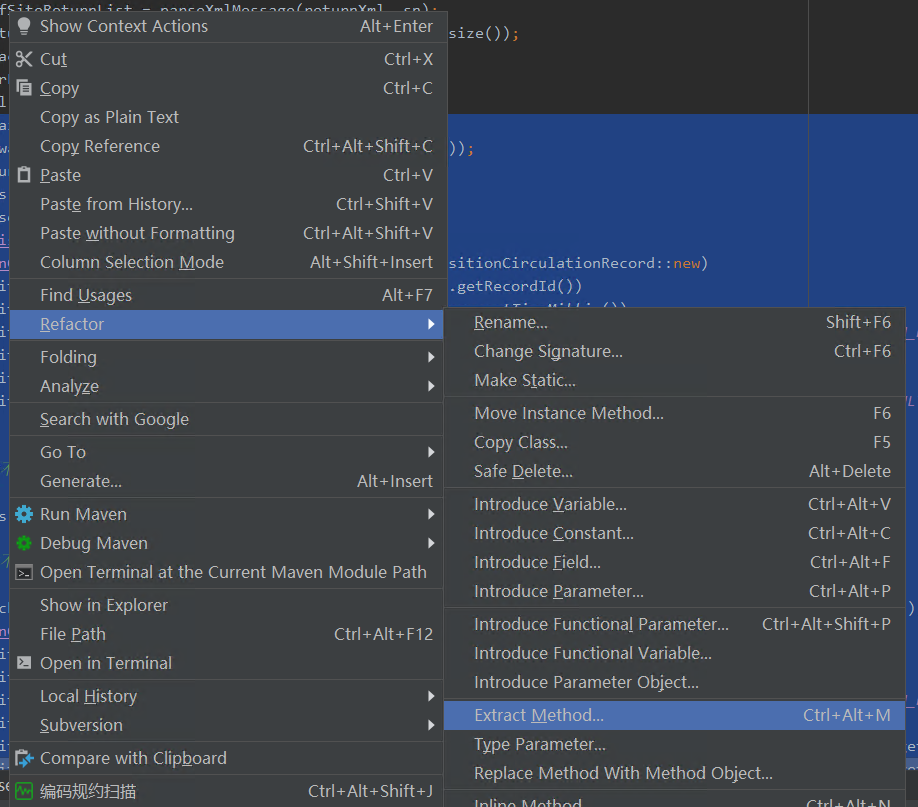

- 认知复杂度
    - sonar认知复杂度计算规则
        - &&、\|\|
        - if、else if、else、switch
        - for、while、do while
        - catch
        - break、continue
        - 不超过15
    - 短小的方法、做好抽象层级、单一权责原则（编码原则）
      
        ```java
        /**
        * easy to understand
        **/
        while(theWorldTurns) {
          if(isMorning) {
            welcomeWords();
          }
        }
        void welcomeWords() {
            try {
              if (env.debugMode()) {
                System.out.println("Hello, world!");
              }
            } catch (BadDay e) {
              System.out.println("Yikes!");
            }
        }
        
        /**
        * more complex
        **/
        while(theWorldTurns) {
          if(isMorning) {
            try {
              if (env.debugMode()) {
                System.out.println("Hello, world!");
              }
            } catch (BadDay e) {
              System.out.println("Yikes!");
            }
          }
        }
        ```
        
    - 代码重构
        - 单元测试（重构之前需要写好单元测试，以便重构后验证代码的正确）
        - 一些具体操作
            - for循环中仅做一件事情（仅为解决sonar扫描，是否真的更简洁还待斟酌）
              
                java.util.Collection.stream 、java.util.Map.compute
                
                ```java
                //累加商品id相同的sku的数量
                for (OrderSkuQuery orderSkuQuery : orderSkuQueryList) {
                    if (res.containsKey(orderSkuQuery.getItemsId())) {
                        res.put(orderSkuQuery.getItemsId(), orderSkuQuery.getSkuNum() + res.get(orderSkuQuery.getItemsId()));
                    } else {
                        res.put(orderSkuQuery.getItemsId(), orderSkuQuery.getSkuNum());
                    }
                }
                ```
                
                ```java
                Map<Long, Integer> res = Maps.newHashMap();
                orderSkuQueryList.stream().forEach(orderSkuQuery -> res.compute(orderSkuQuery.getItemsId(),
                    (k, v) -> v == null ? orderSkuQuery.getSkuNum() : v + orderSkuQuery.getSkuNum()));
                ```
                
            - 抽离方法
                - 减少for循环中的if else、continue（过长的条件判断等）
                  
                    ```java
                    for (Map.Entry<Long, ItemsDTO> entry : itemsDTOMap.entrySet()) {
                        Long itemsId = entry.getKey();
                        ItemsDTO itemsDTO = entry.getValue();
                        List<OrderSkuQuery> orderSkuQueries = orderSkuQueryMap.get(itemsId);
                        RestrictionDTO restrictionDTO = itemsDTO.getRestrictionDTO();
                        /**
                        * 当前spu下没有sku 或
                        * 商品限购数量为0表示不限购
                        **/
                        if (CollectionUtils.isEmpty(orderSkuQueries) || Integer.valueOf(0).equels(restrictionDTO.getRestriction())) {
                            continue;    
                        }
                    }
                    ```
                    
                    ```java
                    /**
                    * 在for外围将过长的条件判断抽取出来
                    **/
                    Map<Long, ItemsDTO> itemsWithRestrictionMap = itemsDTOMap.entrySet().stream()
                                                                                                                                                            .filter(entry -> !withoutRestriction(orderSkuQueryMap.get(entry.getKey()), entry.getValue()))
                                                                                                                                                            .collect(Collectors.toMap(Entry::getKey, Entry::getValue));
                    for (Map.Entry<Long, ItemsDTO> entry : itemsWithRestrictionMap.entrySet()) {
                        Long itemsId = entry.getKey();
                        ItemsDTO itemsDTO = entry.getValue();
                        List<OrderSkuQuery> orderSkuQueries = orderSkuQueryMap.get(itemsId);
                        RestrictionDTO restrictionDTO = itemsDTO.getRestrictionDTO();
                        Integer curCount = res.get(itemsId);
                    }                                                                                                                            
                    ```
                    
                - 抽离try、catch
                  
                    ```java
                    public void delete(Page page) {
                        try {
                            deletePageAndAllReference();
                        } catch (Exception e) {
                            loggerError(e);
                        }
                    }
                    private void deletePageAndAllReference() {
                        deletePage();
                        deleteReference();
                    }
                    ```
                    
                - 抽离方法快捷操作（！！！需要注意代码模块是否在逻辑上关联 ，不要仅仅为了解决复杂度而打断流程）
                  
                    
                
            - 简化if else、switch
                - 提前return，去除不必要的else
                  
                    ```java
                    if(condition){
                        //doSomething   
                    }else{
                        return;
                    }
                    ```
                    
                    ```java
                    if(!condition){
                        return;
                    }
                    //doSomething
                    ```
                    
                - 枚举
                  
                    ```java
                    String OrderStatusDes;
                    if (orderStatus == 0) {
                        OrderStatusDes = "订单未支付";
                    }else if(OrderStatus == 1) {
                        OrderStatusDes = "订单已支付";
                    }else if(OrderStatus == 2) {
                        OrderStatusDes = "已发货";
                    }
                    ```
                    
                    ```java
                    /**
                    * 定义枚举
                    **/
                    public enum OrderStatusEnum {
                        UN_PAID(0, "订单未支付"), PAIDED(1, "订单已支付"), SENDED(2, "已发货"),;
                        private int index;
                        private String desc;
                        
                        public int getIndex () {
                            return index;
                        }
                        public String getDesc(){
                            return desc;
                        }
                        OrderStatusEnum(int index,String desc){
                            this.index = index;
                            this.desc =desc;
                        }
                        OrderStatusEnum of(int orderStatus){
                            for(OrderStatusEnum temp :OrderStatusEnum.values()){
                                if(temp.getIndex()== orderStatus){
                                    return temp;
                                }
                            }
                            return null;
                        }
                    }
                    //优化逻辑分支
                    String OrderStatusDes = OrderStatusEnum.of(orderStatus).getDesc();
                    ```
                    
                - 合并条件表达式
                  
                    ```java
                    double () {
                        if (age < 18) {
                            return 0.8;
                        }
                        if ("深圳".equals(city)) {
                            return 0.8;
                        }
                        if (isStudent) {
                            return 0.8;
                        }
                        //do somethig
                    }
                    ```
                    
                    ```java
                    double () {
                        if (age < 18 || "深圳".equals(city) || isStudent) {
                        return 0.8;
                        }
                        //doSomthing
                    }
                    ```
                    
                - 使用Optional来判非空（StringUtils等工具类isEmpty()判空）
                  
                    ```java
                    String str = "xqding";
                    if (str != null) {
                        System.out.println(str);
                    } else {
                        System.out.println("Null");
                    }
                    ```
                    
                    ```java
                    Optional<String> strOptional = Optional.ofNullable("xqding");
                    strOptional.ifPresent(System.out::println,()->System.out.println("Null"));
                    ```
                    
                - 优化逻辑结构
                  
                    ```java
                    public double getAdjustedCapital () {
                        if (capital <= 0.0) {
                            return 0.0;
                        }
                        if (intRate > 0 && duration > 0) {
                            return (income / duration) * ADJ_FACTOR;
                        }
                        return 0.0;
                    
                    }
                    ```
                    
                    ```java
                    /**
                    * 条件反转使异常情况先退出
                    **/
                    public double getAdjustedCapital () {
                        if (capital <= 0.0) {
                            return 0.0;
                        }
                        if (intRate <= 0 || duration <= 0) {
                            return 0.0;
                        }
                        return (income / duration) * ADJ_FACTOR;
                    }
                    ```
                    
                - 表驱动法（！推荐）
                  
                    ```java
                    if (param.equals(value1)) {
                        doAction1(someParams);
                    }else if(param.equals(value2)) {
                        doAction2(someParams);
                    }else if(param.equals(value3)) {
                        doAction3(someParams);
                    }
                    ```
                    
                    ```java
                    Map<?,Function<?> action> actionMappings =new HashMap<>();// 这里泛型 ? 是为方便演示，实际可替换为你需要的类型
                    // 初始化
                    actionMappings.put(value1,(someParams)->{ doAction1(someParams)});
                    actionMappings.put(value2,(someParams)->{ doAction2(someParams)});
                    actionMappings.put(value3,(someParams)->{ doAction3(someParams)});
                    // 省略多余逻辑语句
                    actionMappings.get(param).apply(someParams);
                    ```
                    
                - 工厂方法——可扩展、易读
                  
                    对象的某个行为在不同场景中有不同的实现方法
                    
                    ```java
                    String medalType = "guest";
                    if ("guest".equals(medalType)) {
                        System.out.println("嘉宾勋章");
                    } else if("vip".equals(medalType)) {
                        System.out.println("VIP勋章");
                    } else if("guard".equals(medalType)) {
                        System.out.println("守护勋章");
                    }
                    
                    //switch同上
                    ```
                    
                    具体步骤：
                    
                    步骤1：将每个条件逻辑代码块抽象成公共接口
                    
                    步骤2：根据逻辑条件定义相应的策略实现类
                    
                    步骤3：定义策略工厂类，管理勋章实现策略类
                    
                    步骤4：修改逻辑代码
                    
                    - 1：将每个条件逻辑代码块抽象成公共接口
                      
                        ```java
                        public interface IMedalService {
                            void showMedal();
                            String getMedalType();
                        }
                        ```
                        
                    - 2：根据逻辑条件定义相应的策略实现类
                      
                        ```java
                        //守护勋章策略实现类
                        public class GuardMedalServiceImpl implements IMedalService {
                        
                            @Override
                            public void showMedal() {
                            System.out.println("展示守护勋章");
                            }
                        
                            @Override
                            public String getMedalType() {
                            return "guard";
                            }
                        }
                        //嘉宾勋章策略实现类
                        public class GuestMedalServiceImpl implements IMedalService {
                        
                            @Override
                            public void showMedal() {
                            System.out.println("嘉宾勋章");
                            }
                        
                            @Override
                            public String getMedalType() {
                            return "guest";
                            }
                        
                        }
                        //VIP勋章策略实现类
                        public class VipMedalServiceImpl implements IMedalService {
                        
                            @Override
                            public void showMedal() {
                            System.out.println("会员勋章");
                            }
                        
                            @Override
                            public String getMedalType() {
                            return "vip";
                            }
                        }
                        ```
                        
                    - 3：定义策略工厂类，管理勋章实现策略类
                      
                        ```java
                        public class MedalServicesFactory {
                        
                            private static final Map<String, IMedalService> map = newHashMap <>();
                            static {
                            map.put("guard", newGuardMedalServiceImpl());
                            map.put("vip", newVipMedalServiceImpl());
                            map.put("guest", newGuestMedalServiceImpl());
                            }
                            public static IMedalService getMedalService(String medalType) {
                            return map.get(medalType);
                            }
                        }
                        ```
                        
                    - 4：逻辑代码
                      
                        ```java
                        public class Test {
                        
                            public static void main(String[] args) {
                            String medalType = "guest";
                            IMedalService medalService = MedalServicesFactory.getMedalService(medalType);
                            medalService.showMedal();
                            }
                        }
                        ```
            
        - 验证重构 单元测试
    - 实例
        - 对象的某个行为在不同场景中有不同的实现方法的不同解决办法
          
            实例1：使用表驱动Map

            ```java
            //设置Map
            public class IpsCriticalAssetTrafficMapModel extends IpsCriticalAssetTrafficModel {
                public IpsCriticalAssetTrafficMapModel(){
                    getStringFunctionMap();
                }
            
                private Map<String, Function<String, IpsCriticalAssetTrafficMapModel>> ipsTranslate = new HashMap<>();
            
                public Map<String, Function<String, IpsCriticalAssetTrafficMapModel>> getIpsTranslate() {
                    return ipsTranslate;
                }
                
                @Override
                public void getStringFunctionMap() {
                    ipsTranslate.put(AvroConstant.IPS_ASSET_TRAFFIC_AVRO_FIELD_NAME_ID, v -> {
                        this.setId(Integer.parseInt(v));
                        return this;
                    });
                    ipsTranslate.put(AvroConstant.IPS_ASSET_TRAFFIC_AVRO_FIELD_NAME_CONNECTION, v -> {
                        this.setConnection(Long.parseLong(v));
                        return this;
                    });
                    ipsTranslate.put(AvroConstant.IPS_ASSET_TRAFFIC_AVRO_FIELD_NAME_IBANDWIDTH, v -> {
                        this.setiBandWidth(Long.parseLong(v));
                        return this;
                    });
                    ipsTranslate.put(AvroConstant.IPS_ASSET_TRAFFIC_AVRO_FIELD_NAME_OBANDWIDTH, v -> {
                        this.setoBandWidth(Long.parseLong(v));
                        return this;
                    });
                    return;
                }
            
            }
            
            //逻辑代码
            GenericDatumReader<GenericRecord> datumReader = new GenericDatumReader<>(schema);
            InputStream is = new ByteArrayInputStream(data);
            BinaryDecoder decoder = DecoderFactory.get().binaryDecoder(is, null);
            GenericRecord genericRecord = null;
            List<IpsCriticalAssetTrafficModel> ipsCriticalAssetTrafficList = new ArrayList<>();
            while (!decoder.isEnd()) {
                try {
                    genericRecord = datumReader.read(genericRecord, decoder);
                    List<Schema.Field> fields = genericRecord.getSchema().getFields();
            
                    IpsCriticalAssetTrafficMapModel ipsCriticalAssetTrafficMapModel = new IpsCriticalAssetTrafficMapModel();
            
                    for (Schema.Field field : fields) {
                        String name = field.name();
                        String value = String.valueOf(genericRecord.get(name));
                        ipsCriticalAssetTrafficMapModel.getStringFunctionMap();
                        ipsCriticalAssetTrafficMapModel = ipsCriticalAssetTrafficMapModel.getIpsTranslate().get(name.toLowerCase()).apply(value);
                    }
                    ipsCriticalAssetTrafficList.add(ipsCriticalAssetTrafficMapModel);
                } catch (Exception e) {
                    LOGGER.error(e.getMessage(), e);
                }
            }
            
            ```
            
            实例2：使用工厂方法
            
            ```java
            //Step 1 将每个条件逻辑代码块抽象成公共接口
            public interface IFieldService {
                void combineThreatEvent(ThreatEvent threatEvent, Object value);
                String getName();
            }
            
            //Step 2 根据逻辑条件定义相应的策略实现类
            public class ActionIdFieldServiceImpl implements IFieldService {
                @Override
                public void combineThreatEvent(ThreatEvent threatEvent, Object value) {
                    threatEvent.setActionId(Integer.parseInt(String.valueOf(value)));
                }
                
                @Override
                public String getName() {
                    return ThreatEventFieldNameConstant.THREAT_FIELD_ACTION_ID;
                }
            }
            public class AppIdFieldServiceImpl implements IFieldService {
                @Override
                public void combineThreatEvent(ThreatEvent threatEvent, Object value) {
                    threatEvent.setAppId(Integer.parseInt(String.valueOf(value)));
                }
                
                @Override
                public String getName() {
                    return ThreatEventFieldNameConstant.THREAT_FIELD_APP_ID;
                }
            }
            
            //Step 3 定义策略工厂类，管理勋章实现策略类
            public class FieldServiceFactory {
                private static final Map<String, IFieldService> map = new HashMap<>();
            
                static {
                    map.put(ThreatEventFieldNameConstant.THREAT_FIELD_ACTION_ID, ActionIdFieldServiceImpl);
                    map.put(ThreatEventFieldNameConstant.THREAT_FIELD_APP_ID, AppIdFieldServiceImpl);
                }
                public static IFieldService getFieldService(String name) {
                    return map.get(name);
                }
            }
            
            //Step 4 修改逻辑代码
            genericRecord = datumReader.read(genericRecord, decoder);
            List<Schema.Field> fields = genericRecord.getSchema().getFields();
            ThreatEventModel threatEvent = new ThreatEventModel();
            threatEvent.setSn(sn);
            for (Schema.Field field : fields) {
                String name = field.name();
                Object value = genericRecord.get(name);
                IFieldService fieldService = FieldServiceFactory.getFieldService(name);
                fieldService.combineThreatEvent(threatEvent, value);
            }
            threatEventList.add(threatEvent);
            ```
    
- 参数过多
    - 多个相同类型容易混淆
      
        ```java
        public Person createPerson(
              final String lastName,
              final String firstName,
              final String middleName,
              final String salutation,
              final String suffix,
              final String streetAddress,
              final String city,
              final String state,
              final boolean isFemale,
              final boolean isEmployed,
              final boolean isHomeOwner)
           {
              // implementation goes here
           }
        ```
        
    - 单一权责原则——拆分函数 调用子函数
    
    - 推导参数关系
      
        ```java
        public myFunction(int var1, int var2, int var3) {
        ...
        }
        ```
        
        ```java
        public myFunction(int var1, int var3) {
            int var2 = getVar2(var1, var3);
        } 
        private int getVar2(int var1, int var3) {
            return var2;
        }
        ```
        
    - JavaBean风格 无参构造函数
      
        好处：
        
        - 可读性
        
        问题：
        
        - 一次性设置属性的大量代码、容易忽略必需值，对象的未定义、不完整（高度可变）
        - 可维护性差
        
        不建议仅仅为了减少参数而使用，适用于与数据库交互或返回应用程序值
        
    - 使用自定义类型
      
        ```java
        public Person createPerson(
              final Name lastName,
              final Name firstName,
              final Name middleName,
              final Salutation salutation,
              final Suffix suffix,
              final StreetAddress address,
              final City city,
              final State state,
              final Gender gender,
              final EmploymentStatus employment,
              final HomeownerStatus homeowner)
           {
              // implementation goes here
           }
        public final class Name
        {
           private final String name;
        
           public Name(final String newName)
           {
              this.name = newName;
           }
        
           public String getName()
           {
              return this.name;
           }
        
           @Override
           public String toString()
           {
              return this.name;
           }
        } 
        public enum Gender
        {
           FEMALE,
           MALE
        }
        ```
        
        好处：
        
        增加可读性
        
        问题：
        
        - 额外实例化和内存使用的开销
        - 编写和测试自定义类型的额外工作
        - 本身未减少参数的数量
        
    - 参数对象
      
        相关参数高内聚
        
        ```java
            public Person createPerson(
              final FullName fullName,
              final Address address,
              final Gender gender,
              final EmploymentStatus employment,
              final HomeownerStatus homeownerStatus)
           {
              // implementation goes here
           }
            public final class FullName
        {
           private final Name lastName;
           private final Name firstName;
           private final Name middleName;
           private final Salutation salutation;
           private final Suffix suffix;
        
           public FullName(
              final Name newLastName,
              final Name newFirstName,
              final Name newMiddleName,
              final Salutation newSalutation,
              final Suffix newSuffix)
           {
              this.lastName = newLastName;
              this.firstName = newFirstName;
              this.middleName = newMiddleName;
              this.salutation = newSalutation;
              this.suffix = newSuffix;
           }
        
           public Name getLastName()
           {
              return this.lastName;
           }
        
           public Name getFirstName()
           {
              return this.firstName;
           }
        
           public Name getMiddleName()
           {
              return this.middleName;
           }
        
           public Salutation getSalutation()
           {
              return this.salutation;
           }
        
           public Suffix getSuffix()
           {
              return this.suffix;
           }
        
           @Override
           public String toString()
           {
              return  this.salutation + " " + this.firstName + " " + this.middleName
                    + this.lastName + ", " + this.suffix;
           }
        }
        ```
        
        好处：
        
        - 减少传递给方法或构造函数的参数数量
        - 易理解
        - 能够为参数对象添加额外的行为和特征以增加功能
        
        问题：
        
        - 额外工作
        - 易被滥用：将不相关的参数捆绑到一个类
        
    - 状态（不建议使用）
        - 全局变量：有状态的单例 违反封装和数据隐藏原则
        - 成员变量
          
            ```java
                /**
                * instance state
                **/
              public void doSomethingGoodWithInstanceVariables()
               {
                  this.person =
                     Person.createInstanceWithNameAndAddressOnly(
                        new FullName.FullNameBuilder(new Name("Flintstone"), new Name("Fred")).createFullName(),
                        new Address.AddressBuilder(new City("Bedrock"), State.UN).createAddress());
                  printPerson();
               }
               public void printPerson()
               {
                  out.println(this.person);
               }
            ```
            
            ```java
                
                /**
                * 传递参数
                **/
                public void doSomethingGoodWithoutInstanceVariables()
               {
                  final Person person =
                     Person.createInstanceWithNameAndAddressOnly(
                        new FullName.FullNameBuilder(new Name("Flintstone"), new Name("Fred")).createFullName(),
                        new Address.AddressBuilder(new City("Bedrock"), State.UN).createAddress());
                  printPerson(person);
               }
               public void printPerson(final Person person)
               {
                  out.println(person);
               }
            ```
            
            不要仅仅因为减少参数而引入不必要的实例，会付出多线程的代价
            
        
        好处：
        
        - 可直接访问、无需传递参数
        - 更容易编写代码
        
        问题：
        
        - 隐藏依赖关系
        - 违背面向对象设计原则、破坏封装特性
        - 并发时不确定性
        
    - 方法重载
      
        避免不适用或可选参数传递空值
        
        ```java
            public Person createPerson(
              final String lastName,
              final String firstName,
              final String middleName,
              final String salutation,
              final String suffix,
              final String streetAddress,
              final String city,
              final String state,
              final boolean isFemale,
              final boolean isEmployed,
              final boolean isHomeOwner)
           {
              // implementation goes here...
           }
        
           public Person createPerson(
              final String lastName,
              final String firstName,
              final String streetAddress,
              final String city,
              final String state)
           {
              // implementation goes here...
           }
        
           public Person createPerson(
              final String lastName,
              final String firstName,
              final boolean homeOwnerStatus)
           {
              // implementation goes here...
           }
        ```
        
        ```java
        public Person createPerson(
              final String lastName,
              final String firstName,
              final HomeownerStatus homeOwnership)
           {
              // implementation goes here...
           }
        
           public Person createPerson(
              final String lastName,
              final String firstName,
              final Gender gender)
           {
              // implementation goes here...
           }
        
           public Person createPerson(
              final String lastName,
              final String firstName,
              final EmploymentStatus employmentStatus)
           {
              // implementation goes here...
           }
        ```
        
        好处：
        
        - 参数可选时很有效
        
        问题：
        
        - 可读性问题
        - 必须使用注释来解释重载方法的含义
        - 大量的维护工作——添加、删除、更改属性或方法的参数时
        
    - 传入部分参数，剩余set
        - set比预期更容易改变且易错（某些场景不希望实例化后更改对象状态）
        - 在并发和面向对象接口中，不加选择的提供set方法会产生问题
        - 不符合面向对象设计原则
        
    - 方法命名
      
        静态初始化工厂实例化类
        
        ```java
                private Person(
              final FullName newName, 
                    final Address newAddress,
              final Gender newGender, 
                    final EmploymentStatus newEmployment,
              final HomeownerStatus newHomeOwner)
           {
              this.name = newName;
              this.address = newAddress;
              this.gender = newGender;
              this.employment = newEmployment;
              this.homeOwnerStatus = newHomeOwner;
           }
         
           public static Person createInstanceWithNameAndAddressOnly(
              final FullName newName, final Address newAddress)
           {
              return new Person(newName, newAddress, null, null, null);
           }
           
           public static Person createEmployedHomeOwningFemale(
              final FullName newName, final Address newAddress)
           {
              return new Person(
                 newName, newAddress, Gender.FEMALE, EmploymentStatus.EMPLOYED, HomeownerStatus.HOME_OWNER);
           }
        
           public static Person createEmployedHomeowningMale(
              final FullName newName, final Address newAddress)
           {
              return new Person(
                  newName, newAddress, Gender.MALE, EmploymentStatus.EMPLOYED, HomeownerStatus.HOME_OWNER);
           }
        
           public static Person createUnemployedMaleRenter(
              final FullName newName, final Address newAddress)
           {
              return new Person(
                 newName, newAddress, Gender.MALE, EmploymentStatus.NOT_EMPLOYED, HomeownerStatus.RENTER);
           }
        
                /**
                * 结合方法重载和静态初始化工厂方法
                **/
           public static Person createPersonWithFirstNameLastNameAndAddress(
              final Name newFirstName, final Name newLastName, final Address newAddress)
           {
              return new Person(
                 new FullName.FullNameBuilder(newLastName, newFirstName).createFullName(),
                 newAddress, null, null, null);
           }
        
           public static Person createPersonWithFirstNameLastNameAndAddress(
              final String newFirstName, final String newLastName, final Address newAddress)
           {
              return new Person(
                 new FullName.FullNameBuilder(new Name(newLastName), new Name(newFirstName)).createFullName(),
                 newAddress, null, null, null);
           }
        ```
        
        好处：
        
        - 易读，无需提供大量的参数（相比方法重载，方法名可以包含参数的单位或者其它背景信息）
        - 为用户呈现了一个更整洁、更友善的接口并且隐藏了类定义中的带有过多参数构造函数
        
        问题：
        
        - 必须编写大量方法来支持可能使用的参数的各种组合和排列
        - 必须浏览一长串长方法名
        
    - 建造者模式
        - 改编的建造者模式（存在必选与可选属性）
            - 具体步骤
                - 在待重构类中创建一个静态内部类 Builder，然后将待重构类中的参数都复制到Builder类中
                - 在待重构类中创建一个private的构造函数，参数为Builder类型
                - 在Builder中创建一个`public`的构造函数，参数为待重构类中必填的那些参数
                - 在Builder中创建设置函数，对待重构类中那些可选参数进行赋值，返回值为Builder类型的实例
                - 在Builder中创建一个`build()`方法，在其中构建待重构类的实例并返回
                
                ```java
                public class Computer {
                    private final String cpu;//必须
                    private final String ram;//必须
                    private final int usbCount;//可选
                    private final String keyboard;//可选
                    private final String display;//可选
                
                    private Computer(Builder builder){
                        this.cpu=builder.cpu;
                        this.ram=builder.ram;
                        this.usbCount=builder.usbCount;
                        this.keyboard=builder.keyboard;
                        this.display=builder.display;
                    }
                    public static class Builder{
                        private String cpu;//必须
                        private String ram;//必须
                        private int usbCount;//可选
                        private String keyboard;//可选
                        private String display;//可选
                
                        public Builder(String cup,String ram){
                            this.cpu=cup;
                            this.ram=ram;
                        }
                
                        public Builder setUsbCount(int usbCount) {
                            this.usbCount = usbCount;
                            return this;
                        }
                        public Builder setKeyboard(String keyboard) {
                            this.keyboard = keyboard;
                            return this;
                        }
                        public Builder setDisplay(String display) {
                            this.display = display;
                            return this;
                        }        
                        public Computer build(){
                            return new Computer(this);
                        }
                    }
                  //省略getter方法
                }
                ```
                
                ```java
                Computer computer=new Computer.Builder("因特尔","三星")
                                .setDisplay("三星24寸")
                                .setKeyboard("罗技")
                                .setUsbCount(2)
                                .build();
                ```
            
        - 建造者、自定义类型、参数对象（推荐）
          
            ```java
            public class Computer {
                private final Cpu cpu;//必须
                private final Ram ram;//必须
                private final External device;//可选
            
                private Computer(Builder builder){
                    this.cpu=builder.cpu;
                    this.ram=builder.ram;
                    this.device = device;
                }
                public static class Builder{
                        private final Cpu cpu;//必须
                        private final Ram ram;//必须
                        private final External device;//可选
            
                    public Builder(Cpu cpu, Ram ram){
                        this.cpu=cpu;
                        this.ram=ram;
                    }
            
                    public Builder setDevice(External device) {
                        this.device = device;
                        return this;
                    }
            
                    public Computer build(){
                        return new Computer(this);
                    }
                }
              //省略getter方法
            }
            ```
            
        
        好处：
        
        - 参数过多时强制必选（避免无效状态）
          
            ```java
            Rectangle r = new Rectange(); // r is invalid
            r.setWidth(2); // r is invalid
            r.setHeight(3); // r is valid
            
            Rectangle r = new Rectange(); // r is invalid
            r.setWidth(2); // r is invalid
            r.setHeight(-1); // r is invalid
            ```
            
            ```java
            public Builder setWidth(int width) {
                if (width <= 0) {
                    throw new IllegalException("……");
                }
              this.width = width;
              return this;
            }
            public Builder setHeight(int height) {
                if (height <= 0) {
                    throw new IllegalException("……");
                }
              this.height = height;
              return this;
            }
            //valid
            Rectangle r1 = new Rectange().Builder()
                            .setHeight(2)
                            .setWidth(3)
                            .build();
            //invalid
            Rectangle r2 = new Rectange().Builder()
                            .setHeight(2)
                            .setWidth(-1)
                            .build();
            ```
            
        - 配置项依赖关系或约束条件（集中校验，通过后才能创建对象）
          
            ```java
            public Computer build(){
                if (约束条件) {}
              return new Computer(this);
            }
            ```
            
        - 不能修改，在类中不暴露set()方法
        
    - 方法返回
      
        对象传递，改变入参内容（违反最小惊讶原则） 仅用于返回调用信息
        
    - Hash表
    
    - 避免传入标志位
